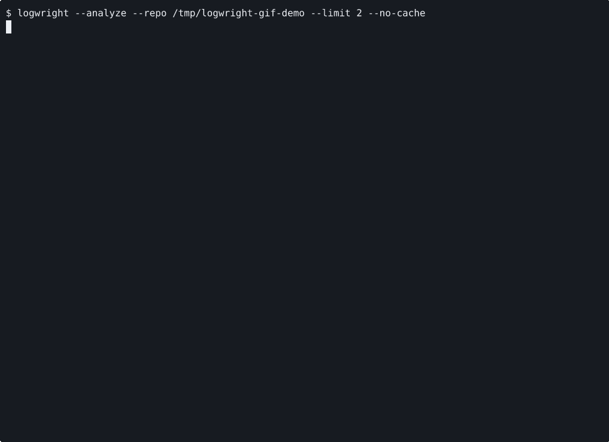

# logwright

`logwright` is a CLI tool for grading git commit messages against their actual diffs and helping write better ones from staged changes.

Focused demo: analyze a vague commit against its diff and generate a reword plan.



[Demo Transcript](docs/demo.md) · [Roadmap](ROADMAP.md) · [License](LICENSE)

## Highlights

- Score commit messages against the change itself, not just the subject line in isolation.
- Detect local repo conventions such as Conventional Commits and scoped subjects.
- Generate actionable reword plans for weak commits.
- Check pending commit messages before they land, suitable for `commit-msg` hooks and amend/reword flows.
- Install a repo-local `commit-msg` hook instead of hand-writing the shell script.
- Surface provider fallback reasons when a live model call fails and heuristics take over.
- Estimate provider cost from token usage for the default shipping models.
- Generate commit message suggestions from `git diff --cached`.
- Analyze recent commits in the current repository or a remote git URL.
- Fall back to deterministic heuristics when no LLM key is configured.

## Install

Python 3.11+ is required.

```bash
python3 -m venv .venv
source .venv/bin/activate
pip install -e .
```

## Quickstart

After installation, analyze the current repository:

```bash
logwright --analyze
```

## Usage

Analyze the current repository:

```bash
logwright --analyze
```

Analyze a remote repository with a shallow temp clone:

```bash
logwright --analyze --url https://github.com/steel-dev/steel-browser --limit 25
```

Print machine-readable output:

```bash
logwright --analyze --json
```

Suggest commit messages from staged changes:

```bash
logwright --write
```

Print suggestions without interactive prompts:

```bash
logwright --write --print-only
```

Check a pending commit message against staged changes:

```bash
logwright --commit-msg-file .git/COMMIT_EDITMSG --min-score 5
```

Install a repo-local `commit-msg` hook (defaults to heuristic mode):

```bash
logwright --install-commit-msg-hook
```

Use heuristic mode only:

```bash
logwright --analyze --provider heuristic
```

Print the installed version:

```bash
logwright --version
```

## Versioning

`logwright` follows Semantic Versioning. While the project is still in the `0.x` stage,
scoring heuristics, provider-specific output details, and machine-readable payload shape may
still evolve between minor releases. The core CLI surface is intended to remain compact and
predictable: `--analyze`, `--write`, `--commit-msg-file`, `--provider`, `--json`,
`--install-commit-msg-hook`, and `--version`.

## Providers

`logwright` supports:

- `anthropic`
- `openai`
- `gemini`
- `auto`
- `heuristic`

`auto` prefers Anthropic when `ANTHROPIC_API_KEY` is present, then OpenAI when `OPENAI_API_KEY` is present, then Gemini when `GEMINI_API_KEY` is present, and finally falls back to heuristics.

For `--install-commit-msg-hook`, omitting `--provider` installs a repo-local heuristic hook by
default. Pass `--provider anthropic`, `--provider openai`, `--provider gemini`, or an explicit
`--provider auto` if you want model-backed hook checks.

`logwright` auto-loads a repo-local `.env` file before provider resolution, so you can keep API keys in the project root without exporting them into your shell.

Local smoke-test snapshot in this repo on 2026-04-20

These entries reflect one local live run per provider path on that date. The checked-in demo
transcript below is intentionally smaller and only shows a representative subset.

| Provider | Analyze mode | Write suggestions | Notes |
|---|---|---|---|
| Anthropic | Locally smoke-tested | Locally smoke-tested | Uses JSON prompting with local schema validation |
| OpenAI | Locally smoke-tested | Locally smoke-tested | Uses Responses API structured outputs |
| Gemini | Locally smoke-tested | Locally smoke-tested | Uses structured JSON output with `thinkingBudget: 0` and transient retries |
| Heuristic | Locally smoke-tested | Locally smoke-tested | No API key required |

If a provider call fails at runtime, `logwright` falls back to heuristics and prints the fallback reason in the terminal output. When no fallback occurs, those lines are omitted to keep the report compact.

Estimated API cost uses the current standard text-token rates for the default shipping models as
of 2026-04-20:

- `gpt-5.4-mini`: $0.75 / 1M input, $4.50 / 1M output
- `claude-sonnet-4-6`: $3.00 / 1M input, $15.00 / 1M output
- `gemini-2.5-flash`: $0.30 / 1M input, $2.50 / 1M output

Environment variables:

```bash
export ANTHROPIC_API_KEY=...
export OPENAI_API_KEY=...
export GEMINI_API_KEY=...
```

Optional model overrides:

```bash
export LOGWRIGHT_ANTHROPIC_MODEL=claude-sonnet-4-6
export LOGWRIGHT_OPENAI_MODEL=gpt-5.4-mini
export LOGWRIGHT_GEMINI_MODEL=gemini-2.5-flash
```

Or pass a model explicitly:

```bash
logwright --analyze --provider openai --model gpt-5.4-mini
logwright --analyze --provider gemini --model gemini-2.5-flash
```

## Example output

```text
$ logwright --analyze --provider heuristic --url https://github.com/steel-dev/steel-browser --limit 2
Analyzed 2 commits in https://github.com/steel-dev/steel-browser
Detected style: Conventional Commits
Provider: heuristic (heuristic)

COMMITS THAT NEED WORK
No commits landed in the lowest bucket.

WELL-WRITTEN COMMITS
- 9bc3ebb "fix: wrap live session script in IIFE to avoid global scope collisions (#273)"
  Score: 8/10
  Why: Message language overlaps with the changed files or identifiers.

YOUR STATS
Average score: 6.5/10
Vague commits: 0
Very short commits: 0
Cache hits: 0
Cache misses: 2
Model tokens: in=0, out=0
Estimated API cost: $0.0000 (heuristic mode)
```

## Hook usage

Install a minimal heuristic `commit-msg` hook:

```bash
logwright --install-commit-msg-hook
```

That generates the equivalent of:

```sh
#!/bin/sh
logwright --commit-msg-file "$1" --provider heuristic --min-score 5
```

The generated hook uses the current Python interpreter path. When Logwright is being run from a
source checkout instead of an installed package, it also pins that checkout on `PYTHONPATH` so
the hook keeps working from other repositories.

If Git is currently inheriting a shared hooks directory, Logwright sets a local `core.hooksPath`
for the target repo before writing the hook so the installation stays repo-local.

If the score falls below the threshold, `logwright` exits nonzero and prints a suggested
replacement message based on the staged diff.

If there is no staged diff, `logwright` falls back to the current `HEAD` commit so
message-only amend and reword flows still work.

If you want model-backed hook checks instead, pass `--provider anthropic`, `--provider openai`,
or `--provider gemini` explicitly during installation so latency and cost are an intentional
choice:

```bash
logwright --install-commit-msg-hook --provider openai --min-score 6 --force
```

## Design Decisions

- Diff-aware grading first. A message is only useful relative to what actually changed.
- Hybrid scoring. Deterministic lint catches obvious low-signal subjects cheaply; LLM judgment handles fidelity and rewrite quality.
- Repo-style calibration. Conventional Commit usage is detected instead of imposed globally.
- Transparent fallback. If no model key is available or a provider call fails, the flow stays usable and reports why.
- Explicit hook installation. The tool can install its own `commit-msg` hook instead of leaving setup as manual shell glue.
- Local caching. Results are cached under `~/.cache/logwright` by commit SHA, repo identity, style signature, provider, and model.
- Actionable cleanup. Weak commits produce a reword-ready plan instead of only a report card.
- Hook-friendly validation. Pending commit messages can be checked against the staged diff, or against `HEAD` during message-only amend and reword flows.
- Cost visibility. Terminal output includes an estimated API cost based on current standard text-token pricing for the supported default models.
- Remote support via shallow clone. It is simple, portable, and preserves access to full git metadata without special-casing GitHub.

## Limitations

- Anthropic currently uses JSON-only prompting plus local validation rather than tool calling.
- Remote analysis uses shallow cloning rather than the GitHub API.
- The heuristic write suggestions are intentionally conservative and can read generic without an LLM provider.
- Cost estimates cover standard text-token billing only; they do not include provider-side caching, Batch discounts, long-context premiums, grounding, or tool-call fees.
- Cost estimates are only available for the built-in default model set and known snapshot aliases.
- HTML export is not implemented yet.

## Pricing sources

```text
OpenAI GPT-5.4 mini: https://developers.openai.com/api/docs/models/gpt-5.4-mini
Anthropic Claude Sonnet 4.6: https://www.anthropic.com/claude/sonnet
Google Gemini 2.5 Flash: https://ai.google.dev/gemini-api/docs/pricing
```

## Development

Run tests:

```bash
python3 -m unittest discover -s tests -v
```

Run directly from source:

```bash
python3 -m logwright --help
```

## License

MIT. See [LICENSE](LICENSE).
